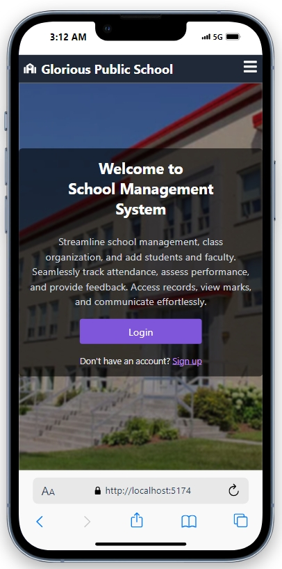
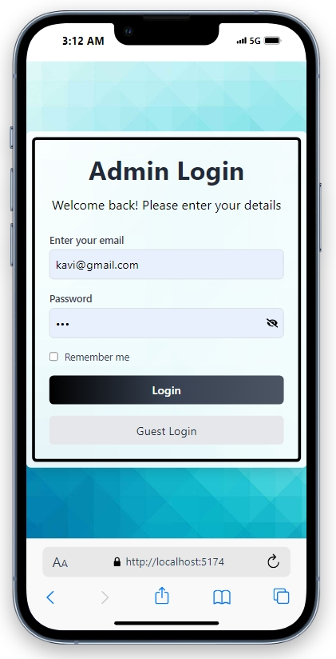
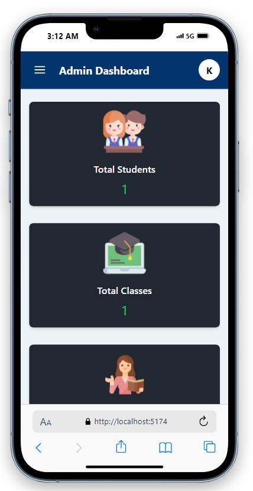
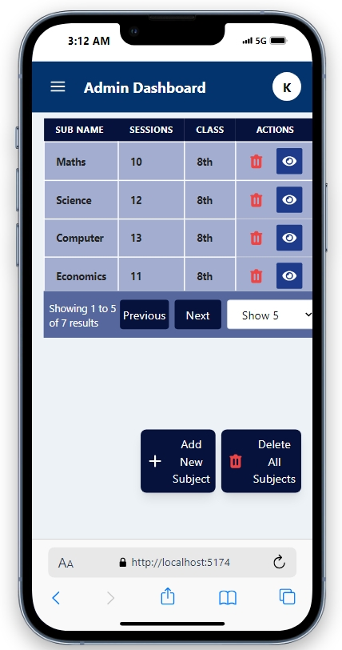
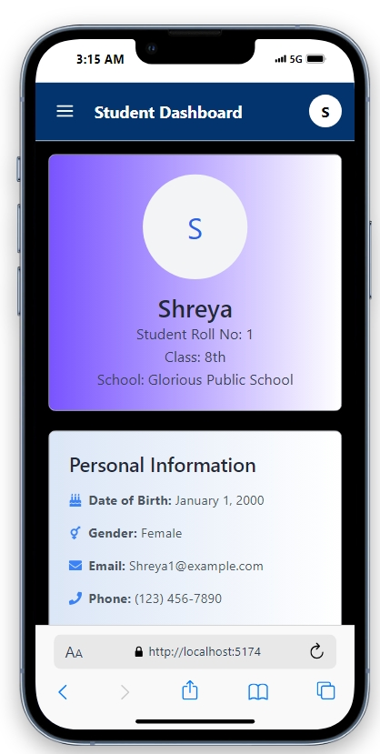
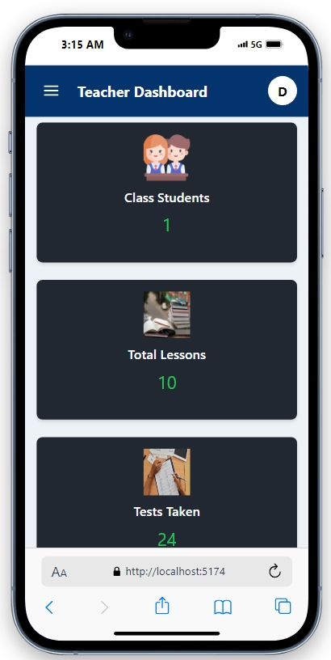

# Student Management System

A web-based application to manage student information efficiently, built using the MERN stack (MongoDB, Express.js, React.js, Redux, Node.js) with Redux for state management and Tailwind CSS for styling.

## Table of Contents

- [Project Purpose](#project-purpose)
- [Technologies](#technologies)
- [Quick Tour](#quick-tour)
- [Video Overview](#video-overview)
- [How to Run the App](#how-to-run-the-app)

## Project Purpose

- **Manage Student Data Efficiently**: Provide a user-friendly platform to handle all student-related data, such as enrollment, attendance, and grades.
- **User-Friendly Interface**: Offer a clean and interactive user interface using React.js and Tailwind CSS.
- **State Management**: Utilize Redux for efficient state management across the application.
- **Backend Functionality**: Implement robust server-side features with Node.js and Express.js, ensuring secure and efficient data handling.
- **Database Management**: Use MongoDB for scalable and efficient data storage.
- **Secure Access Control**: Implement role-based access control for different user types (e.g., Admin, Teacher, Student).

## Technologies

- **Frontend**:

  - React.js
  - Redux
  - Tailwind CSS

- **Backend**:

  - Node.js
  - Express.js

- **Database**:
  - MongoDB

## Quick Tour

### Responsiveness

<h2 align="center">Responsive Design</h2>
<p align="center">
    
    
    
</p>
<h2 align="center">Responsive Admin Dashboard</h2>
<p align="center">
    
    
    
</p>
<h2 align="center">Responsive Student and Teacher Dashboard</h2>
<p align="center">
    
    
    
</p>

## Video Overview

<h2 align="center">Demo Video</h2>

https://github.com/user-attachments/assets/d4825f19-36f0-4a8d-afe7-428b30db4fab

## How to Run the App

1. **Clone the Repository**:

   ```bash
   git clone https://github.com/yourusername/student-management-system.git
   cd student-management-system

   ```

2. **Set Up Environment Variables**:

   ```bash
   MONGO_URI='your-mongodb-connection-string'
   JWT_SECRET='your-secret-key'
   PORT=8000
   ```

3. **Install Dependencies and Start the Backend Server**:

```bash
cd server
npm install
npm start
```

4. **Install Frontend Dependencies and Start the React App**:

```bash
cd client
npm install
npm start


```
